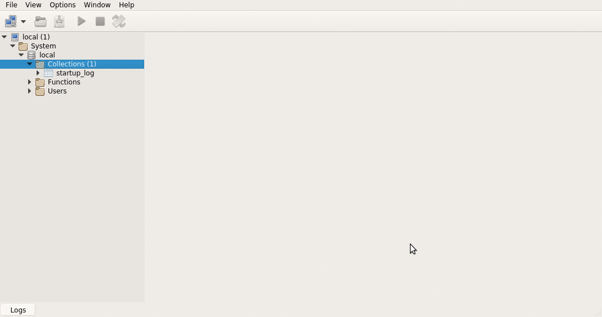

# Ejemplo Fútbol con Springboot y MongoDB

[](https://travis-ci.com/uqbar-project/eg-peliculas-springboot-neo4j)

## Objetivo

Testea el mapeo de una [aplicación de planteles de equipos de fútbol](https://github.com/uqbar-project/eg-peliculas-springboot-neo4j/wiki) con MongoDB. 

## Modelo

La base de datos se estructura en un documento jerárquico:

* equipo 
 * jugadores (no tienen un documento raíz sino que están embebidos dentro del equipo)

## Instalación

Antes de correr los test, tenés que instalar una base de datos [MongoDB Community Edition](https://www.mongodb.com/) y levantar el server. En Windows, [levantan el servicio mongod](https://docs.mongodb.com/manual/tutorial/install-mongodb-on-windows/), en Linux desde una línea de comandos hacen

```bash
$ sudo service mongod start
```

En la carpeta [scripts](scripts) vas a encontrar dos archivos:

* [crear_datos.js](scripts/crear_datos.js) para ejecutarlo en el shell de MongoDB (ejecutable mongo). Este script inserta datos de varios equipos de fútbol con sus jugadores.
* [queries.js](scripts/queries.js) con queries de ejemplo para probar directamente en el shell.

Acá te mostramos cómo correr los scripts con [Robo 3T](https://robomongo.org/) un cliente MongoDB con algunas prestaciones gráficas:



**Los scripts deberías ejecutarlos en la base de datos "local"**. Si elegís otra base tenés que modificar el string de conexión en la clase Xtend _RepoJugadoresMongoDB_.

Luego sí, podés correr los tests del proyecto, que verifica

* que Palermo no está en el plantel de Boca del juego de datos
* que Riquelme sí está en el plantel de Boca del juego de datos
* que hay dos jugadores que comienzan con "Casta" (Castagno de Tigre y Dino Castaño de Boca)

## Las consultas

Para saber si un jugador está en un equipo, la primera consulta que queremos resolver es qué jugadores pertenecen a un equipo. El query en MongoDB es

```js
db.equipos.find({ equipo: 'Boca' })
```

Eso nos devuelve los documentos respetando la jerarquía original:

- Equipo
  - jugadores

Como nosotros queremos que nos devuelva la lista de jugadores, utilizaremos la técnica `aggregate`:

```js
db.equipos.aggregate([ 
  { $unwind: "$jugadores" }, 
  { $match: { "equipo" : "Boca"}},
  { $project: { "nombre" : "$jugadores.nombre", "posicion" : "$jugadores.posicion"}}, 
  { $sort: { nombre: 1 } }
]);
```

Aggregate recibe como parámetro un **pipeline** o una serie de transformaciones que debemos aplicar:

- [**unwind**](https://docs.mongodb.com/manual/reference/operator/aggregation/unwind/) permite deconstruir la jerarquía equipo > jugadores, como resultado obtenemos una lista "aplanada" de jugadores
- **match** permite filtrar los elementos, en este caso seleccionando el equipo de fútbol
- **project** define la lista de atributos que vamos a mostrar, parado desde jugador podemos ir hacia arriba o abajo en nuestra jerarquía. Por ejemplo si queremos traer el nombre del equipo solo basta con agregarlo al final:

```js
db.equipos.aggregate([ 
  ...
  { $project: { "nombre" : "$jugadores.nombre", "posicion" : "$jugadores.posicion", "equipo": "$equipo" }}, 
```

Eso producirá

```js
{ 
  "_id" : ObjectId("60232692edaabd1d5dddeae0"), 
  "nombre" : "Blandi, Nicolás", 
  "posicion" : "Delantero", 
  "equipo" : "Boca"
}
```

Si queremos modificar el nombre de la columna de output debemos hacer este pequeño cambio:

```js
db.equipos.aggregate([ 
  ...
  { $project: { "nombre" : "$jugadores.nombre", "posicion" : "$jugadores.posicion", "nombre_equipo": "$equipo" }}, 
```

entonces el output será

```js
{ 
    "_id" : ObjectId("60232692edaabd1d5dddeae0"), 
    "nombre" : "Blandi, Nicolás", 
    "posicion" : "Delantero", 
    "nombre_equipo" : "Boca"
}
```

## Pasando de MongoDB a Springboot

Ahora que sabemos cómo ejecutar la consulta en Mongo, el controller llamará a una clase repositorio que implementaremos nosotros, ya que la anotación `@Query` todavía no tiene soporte completo para operaciones de agregación.

```xtend
def jugadoresDelEquipo(String nombreEquipo) {
	val matchOperation = Aggregation.match(Criteria.where("equipo").regex(nombreEquipo, "i")) // "i" es por case insensitive
	Aggregation.newAggregation(matchOperation, unwindJugadores, projectJugadores).query
}

def unwindJugadores() {
	Aggregation.unwind("jugadores")
}

def projectJugadores() {
	Aggregation.project("$jugadores.nombre", "$jugadores.posicion")
}

// extension method para ejecutar la consulta	
def query(Aggregation aggregation) {
	val AggregationResults<Jugador> result = mongoTemplate.aggregate(aggregation, "equipos", Jugador)
	return result.mappedResults
}
```

Las operaciones son bastante similares, pero **atención que el orden es importante y puede ocasionar problemas en la devolución correcta de datos**:

- primero el match que filtra por nombre de equipo sin importar mayúsculas/minúsculas (porque está en el documento raíz)
- luego el unwind para aplanar la estructura a una lista de jugadores
- por último definimos los atributos que queremos mostrar
- y luego tenemos un `extension method` para transformar el pipeline de agregación en una lista de elementos para el controller, que luego serializará a json

## Búsqueda de jugadores por nombre

El query para buscar jugadores por nombre en Mongo no difiere mucho de nuestra anterior consulta:

```js
db.equipos.aggregate([ 
  { $unwind: "$jugadores" }, 
  { $match: { "jugadores.nombre": { $regex: "riq.*", $options: "i" }}},
  { $project: { "nombre" : "$jugadores.nombre", "posicion" : "$jugadores.posicion"}}, 
  { $sort: { nombre: 1 } }
]);
```

- primero aplanamos la estructura a una lista de documentos jugadores
- luego filtramos los jugadores que comienzan con "riq", sin importar mayúsculas
- devolveremos los atributos nombre y posición
- ordenando la lista alfabéticamente por nombre, en forma ascendente (1, -1 sería descendente)

Pero debemos prestar atención al pipeline, ya que si invertimos las operaciones unwind y match de esta manera:

```js
db.equipos.aggregate([ 
  { $match: { "jugadores.nombre": { $regex: "riq.*", $options: "i" }}},
  { $unwind: "$jugadores" }, 
  { $project: { "nombre" : "$jugadores.nombre", "posicion" : "$jugadores.posicion"}}, 
  { $sort: { nombre: 1 } }
]);
```

La consulta funciona totalmente distinto, porque en este caso

- primero filtra los equipos que tengan un jugador que comience con "riq", sin importar mayúsculas
- luego aplana la lista de jugadores de esos equipos

Esta misma consideración hay que hacerla cuando definamos la Aggregation:

```xtend
def jugadoresPorNombre(String nombreJugador) {
	val matchOperation = Aggregation.match(Criteria.where("jugadores.nombre").regex(nombreJugador, 'i'))
	Aggregation.newAggregation(unwindJugadores, matchOperation, projectJugadores).query
}
```

## Testeo de integración

El approach que vamos a tomar para los tests es ciertamente cuestionable, pero para mantener el ejemplo simple vamos a asumir que en la base de documentos tenemos la información generada por el script `crear_datos.js`. Con eso en cuenta testearemos

- la búsqueda de jugadores por nombre
  - clase de equivalencia 1: un jugador que está en un equipo
  - clase de equivalencia 2: un jugador que no está en el equipo
- la búsqueda de jugadores por nombre y apellido  
  - recuperamos dos jugadores de distintos equipos satisfactoriamente (única clase de equivalencia)
  
Es interesante remarcar que a este punto no queremos utilizar stubs ni mocks, porque queremos probar que nuestros componentes se conectan a la base y recuperan la información como nosotros queremos. Estamos construyendo entonces tests de integración, que en Springboot se anotan de la siguiente manera:

```xtend
@SpringBootTest(webEnvironment = SpringBootTest.WebEnvironment.DEFINED_PORT)
@AutoConfigureDataMongo
@ExtendWith(SpringExtension)
@DisplayName("Dados varios planteles con jugadores")
class EquipoRepositoryTest {
```

La anotación @AutoConfigureDataMongo es importante para importar la configuración local que se inyecta en la dependencia a MongoTemplate (la que usa nuestra clase repositorio). 

Siguiendo con nuestra idea original, implementemos los tres tests:

```xtend
@Test
@DisplayName("se puede buscar un jugador en base a un equipo")
def void testRiquelmeEsJugadorDeBoca() {
	assertTrue(equipoRepository.jugadoresDelEquipo(BOCA).contieneJugador(RIQUELME))
}

@Test
@DisplayName("un jugador que no está en un equipo no aparece en el plantel")
def void testPalermoYaNoEsJugadorDeBoca() {
	assertFalse(equipoRepository.jugadoresDelEquipo(BOCA).contieneJugador(PALERMO))
}

// extension method - helper para validar si el nombre de un jugador está en una lista de objetos Jugador
def boolean contieneJugador(List<Jugador> jugadores, String unJugador) {
	jugadores.exists [ jugador | jugador.nombre.toLowerCase.contains(unJugador.toLowerCase) ]
}

@Test
@DisplayName("se puede navegar directamente los jugadores a pesar de estar embebidos en los planteles")
def void testHayDosJugadoresQueComienzanConCasta() {
	val jugadores = equipoRepository.jugadoresPorNombre("Casta")
	assertEquals(2, jugadores.size)
}
```

Para que el script de Travis funcione correctamente, levantamos el servicio de Mongo primero y luego invocamos al script que crea los equipos de ejemplo:

```yml
...
services: mongodb

before_script:
  - sleep 15
  - mongo localhost:27017/local ./scripts/crear_datos.js 
...
```

## Alternativas al test que presentamos

Una mejor idea podría ser que el test trabaje con una colección de documentos in-memory, de la misma manera que H2 lo hace para JPA. El lector interesado puede investigar [un ejemplo usando Flapdoodle | Embedded MongoDB](https://www.baeldung.com/spring-boot-embedded-mongodb) (también pueden ver el [proyecto en Github](https://www.baeldung.com/spring-boot-embedded-mongodb)).
